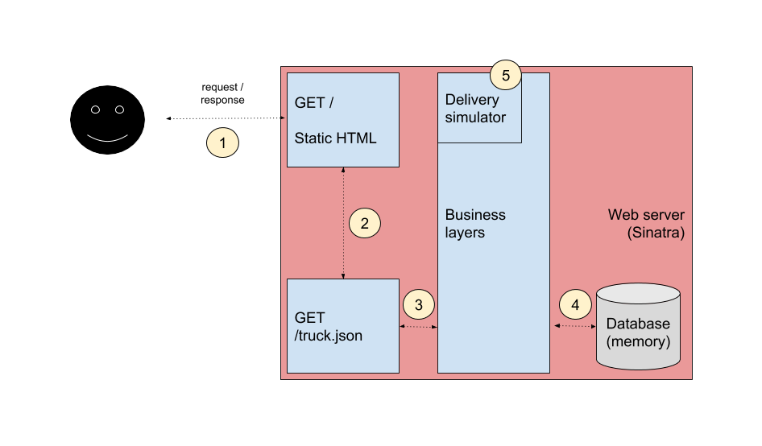

[](https://travis-ci.org/danielfsbarreto/brewery)

# Shane's Brewery Temperature Monitoring

A system that detects whenever beer cargo is either running too hot or too cold.

## Getting Started

These instructions will get you a copy of the project up and running on your local machine for development and testing purposes.

### Prerequisites

- [Ruby](https://www.ruby-lang.org/en/) (2.2.2 or above)
- [Bundler](https://bundler.io/)
- Your favorite browser

### Installing and running the app

Assuming all the prerequisites are properly configured, you only need one command to set things up:

```
bundle install
```

If you want to run the application, execute:

```
PORT=XXXX ruby brewery_app.rb
```

`PORT` is not a mandatory parameter. By default, it starts the server at `4567`. Access it through `http://localhost:XXXX`.

## Ensuring code-wise best practices

[RuboCop](https://github.com/rubocop-hq/rubocop) is a Ruby static code analyzer and code formatter that is used in this project to guarantee everything is consistent across the codebase. Check [this file](.rubocop.yml) to know which rules are being overriden.

To perform all checks, execute:

```
bundle exec rubocop
```

## Running the tests

All server-side specs are written with [RSpec](http://rspec.info/). Therefore, a one-liner will do it:

```
bundle exec rspec
```

## Coding highlights

### Architecture overview

The current version of this app can be summarized by the diagram below:



**1.** Users visualize the temperature monitored of each beer container through the homepage.  
**2.** Every 5 seconds, the front-end piece is responsible for fetching new information from the server through another endpoint, `/truck.json`.  
**3.** This endpoint then asks the business layers for a json representation of the truck and its containers.  
**4.** The business layers deliver this representation, but before that they have to fetch the current state of the entity being requested (currently saved in-memory).  
**5.** A delivery simulator was implemented to make this exercise more dynamic. Its only purpose is to, every 3 seconds, randomly simulate an event on each container. The options are: increase it by 1°C, decrease 1°C or keep the current temperature.

### Constraints

My whole QA/development experience is comprised exclusively of back-end projects. Therefore, the front-end piece of the solution is not covered by unit tests due to my lack of knowledge in the field. Someone could argue that this logic may have been tested through end-to-end tests, which is true. My argument to not go down this path is that, with this version of the app, there isn't much interaction between users and the system. In my opinion, these types of tests only pay off when there are user journeys to be exercised/validated. Unit testing the JavaScript layer should suffice in this context.

On the other hand, speaking of the back-end side, every element is being covered by specs - except the `DeliverySimulator`. The reasoning behind this decision was: first of all, its behavior is, by definition, non-deterministic. Additionally, in a real-life situation, this layer would be completely replaced by a sensor reading mechanism, which should be tested like every other component of the application.

## Q&A

**Q: By default, what is the temperature of each container when they are loaded?**  
A: Usually 0°C.

**Q: How would you like to be notified in the first version of the app?**  
A: I am not very concerned with "how". As I am driving, my assistant will keep an eye on the system all the time.

**Q: Do you also face issues if the containers run too cold?**  
A: Absolutely. If I make them colder than they need - due to insanely hot days - and the beer freezes, its taste will definitely be affected. That's bad for the business.

**Q: How up-to-date these temperatures have to be?**  
A: The more the better. If possible, real-time.

## Future versions

Many improvements are being considered for future releases:
- Better testing coverage of the presentation layer;
- A more pleasant user interface;
- Monitoring of multiple trucks;
- Temperature chart per container.

## Authors

* **Daniel Barreto** - [danielfsbarreto](https://github.com/danielfsbarreto)
